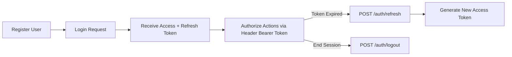

# 🌐 Habit Tracker Service & Algorithm Lab
A professional-grade backend service built with **FastAPI** and **MongoDB**, integrated with a curated collection of **Data Structures** and **Algorithm** implementations. This project demonstrates clean code principles, automated testing, and modular software architecture.

## 📑 Table of Contents
- [Project Overview](#-project-overview)
- [CS Fundamentals Lab](#-cs-fundamentals-lab)
- [Tech Stack](#-tech-stack)
- [Project Structure](#-project-structure)
- [Getting Started](#-getting-started)
- [Authentication Flow](#-authentication-flow)
- [API Endpoints](#-api-endpoints)
- [Testing](#-testing)
- [Roadmap](#-roadmap)
- [Contributing](#-contributing)
- [Author & Support](#-author)

## 📊 Project Overview
The **Habit Tracker** is a modular backend application designed to manage and track daily habits. It uses an asynchronous API-first approach with secure authentication and role-based access control.

### Core Features:
* 🔐 **JWT Authentication** with strict Access & Refresh Token rotation.
* 🛡️ **Role-Based Access Control (RBAC)** distinguishing between standard Users and Admins.
* ⚡ **Complete CRUD Operations** for habits, tracking history, and user profiles.
* 🚏 **Rate Limiting & Security** built-in to prevent brute-force and DDoS attacks.
* 📄 **Cursor/Offset Pagination** for handling large datasets efficiently.
* 📝 **Structured Error Logging** for production monitoring and debugging.
* 🚀 **Asynchronous Architecture:** Driven by FastAPI for high-speed request handling.
* 🗄️ **Elegant ODM Integration:** Powered by Beanie with MongoDB for type-safe data modeling.

## 📘 CS Fundamentals Lab
This module contains high-performance implementations of core computer science concepts, serving as a foundational library for the service's logic.

### 🔹 Algorithms
* **Sorting & Searching:** Production-ready implementations of Merge Sort, Quick Sort, and Binary Search.
* **Optimization:** Logic focused on minimizing time complexity \(O(n \log n)\) and reducing memory footprint.

### 🔹 Data Structures
* **Custom Models:** Stacks, Queues, and Linked Lists tailored for non-relational database data flows.
* **Trees:** Hierarchical data structures alongside efficient traversal and search algorithms.

## 🛠 Tech Stack
* **Backend Framework:** Python 3.10+, FastAPI, Beanie-ODM, Pydantic v2
* **Database:** MongoDB
* **Security:** JWT, Bcrypt, SlowAPI (Rate Limiting), CORS Middleware
* **Quality Assurance:** Pytest, Pytest-Asyncio, Coverage.py

## 📁 Project Structure
```text
habit-tracker-service/
├── data_structure_algorithm/  # Isolated data structures & algorithms module
│   ├── algorithms/            # Advanced sorting & searching source files
│   ├── data_structures/       # Stacks, queues, trees, and linked lists
│   └── tests/                 # Unit tests for CS fundamentals
├── habit-tracker/             # Primary FastAPI web application service
│   ├── app/                   # Application core package
│   │   ├── core/              # Configurations, security & encryption parameters
│   │   ├── db/                # Database connection lifecycle handlers
│   │   ├── dependencies/      # Authentication injectables & RBAC guards
│   │   ├── models/            # Beanie ODM database collection documents
│   │   ├── routes/            # FastAPI router endpoints & controllers
│   │   ├── schemas/           # Pydantic data validation & serialization models
│   │   ├── services/          # Core business logic processing handlers
│   │   ├── utils/             # Global helpers, custom exceptions & enums
│   │   └── main.py            # Application entry point & service startup
│   ├── fastapi_offline_docs/  # Static resources for offline Swagger/ReDoc access
│   ├── venv/                  # Local python virtual environment isolated directory
│   └── requirements.txt       # Managed project production dependencies file
├── LICENSE                    # Repository open-source MIT license parameters
└── README.md                  # System master documentation file
```


## 🚀 Getting Started

### Prerequisites
* **Python** 3.10 or higher installed.
* **MongoDB** server running locally (`localhost:27017`) or an Atlas URI cloud instance.

### Installation & Setup

1. **Clone the repository:**
   ```bash
   git clone https://github.com
   cd habit-tracker-service/backend
   ```

2. **Establish virtual environment:**
   ```bash
   python -m venv venv
   source venv/bin/activate  # On Windows use: venv\Scripts\activate
   ```

3. **Install dependencies:**
   ```bash
   pip install --upgrade pip
   pip install -r requirements.txt
   ```

4. **Configure environment variables:**  
   Create a `.env` file inside the `backend/` directory:
   ```env
   MONGO_URL=mongodb://localhost:27017
   DATABASE_NAME=habit_tracker
   ACCESS_SECRET_KEY=9e8cbf5e712a4b3d8816c70183b2361df89bde0f3b49c43209867da845ef2011
   REFRESH_SECRET_KEY=b24f5a3c109d4e5f7a8b9c0d1e2f3a4b5c6d7e8f9a0b1c2d3e4f5a6b7c8d9e0f
   ALGORITHM=HS256
   ACCESS_TOKEN_EXPIRE_MINUTES=30
   REFRESH_TOKEN_EXPIRE_DAYS=7
   ```

5. **Spin up the service:**
   ```bash
   uvicorn app.main:app --reload --host 0.0.0.0 --port 8000
   ```

6. **Explore interactive API documentation:**
   * **Swagger UI (Interactive):** [http://localhost:8000/docs](http://localhost:8000/docs)
   * **ReDoc (Static/Clean):** [http://localhost:8000/redoc](http://localhost:8000/redoc)

## 🔐 Authentication Flow


## 📚 API Endpoints

### 🔐 Authentication Module

| Method | Endpoint | Description | Protected |
| :--- | :--- | :--- | :--- |
| `POST` | `/auth/login` | Authenticate credentials & emit tokens | ❌ Public |
| `POST` | `/auth/refresh` | Exchange valid refresh token for new access token | ❌ Public |
| `POST` | `/auth/logout` | Invalidate current session parameters | ✔️ Active Session |

### 👥 Users Module

| Method | Endpoint | Description | Access Level |
| :--- | :--- | :--- | :--- |
| `POST` | `/users/` | Register a new user account | ❌ Public |
| `GET` | `/users/me` | Fetch active user profile details | 👤 User |
| `PUT` | `/users/me` | Update personal profile schemas | 👤 User |
| `DELETE` | `/users/me` | Self-terminate user account | 👤 User |
| `GET` | `/users/admin` | Retrieve complete application user registry | 🔑 Admin Only |

### 🏃‍♂️ Habits Module

| Method | Endpoint | Description | Access Level |
| :--- | :--- | :--- | :--- |
| `POST` | `/habits/` | Instantiate a new habit track | 👤 User |
| `GET` | `/habits/` | Query user's current habit listings (Paginated) | 👤 User |
| `GET` | `/habits/search` | Dynamic lookup of habits by query string / name | 👤 User |
| `PUT` | `/habits/{id}` | Modify attributes of a specific habit | 👤 User |
| `DELETE` | `/habits/{id}` | Wipe a habit instance out of history | 👤 User |
| `POST` | `/habits/{id}/complete` | Check-in or mark habit completed for the day | 👤 User |
| `GET` | `/habits/admin` | Master audit logs of all global system habits | 🔑 Admin Only |

## 🧪 Testing
Automated test suites guarantee database operations and analytical algorithmic modules operate seamlessly.

```bash
# Run all tests sequentially
pytest

# Target testing explicitly at core sorting algorithms
pytest data_structure_algorithm/tests/test_sorting.py

# Check test statement block coverage metrics
pytest --cov=app --cov=data_structure_algorithm --cov-report=term-missing
```

## 🔮 Roadmap
- [x] Integrate robust JWT-based User Session Infrastructure.
- [ ] Implement data serialization export modules (`.csv` / `.json`).
- [ ] Train/Integrate lightweight LLM or rule-based AI habit advice microservice.
- [ ] Design analytics engine for completion streaks and visual progress plots.

## 🤝 Contributing
1. Fork the project repository.
2. Check out an isolated feature branch: `git checkout -b feature/amazing-improvement`
3. Commit incremental enhancements: `git commit -m 'Add some amazing feature'`
4. Push to upstream origin: `git push origin feature/amazing-improvement`
5. Open a well-documented **Pull Request**.

### Code Guidelines:
* Code compliance must align perfectly with **PEP 8** standards.
* Enforce strict Python **Type Hinting** primitives everywhere.
* Write atomic, decoupled functions wrapped inside clean **docstrings**.

## 👨‍💻 Author
**Nasir Ahmad Ehsan**  
*Backend Developer & AI Enthusiast*  
GitHub Profile: [@nasir-ehsan-83](https://github.com)

## ⭐ Support
If this engine accelerated your architecture stack, consider leaving a ⭐ on [GitHub](https://github.com/habit-tracker-service)!

*Built with ❤️ using FastAPI and Beanie ODM*
